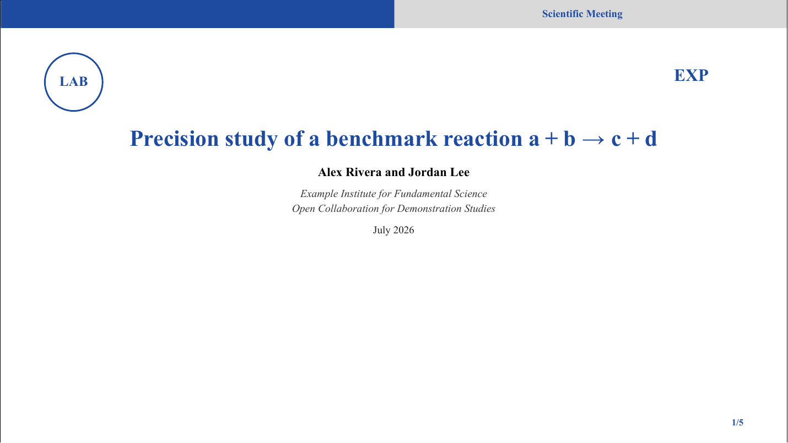
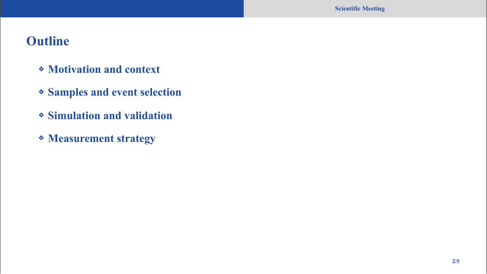
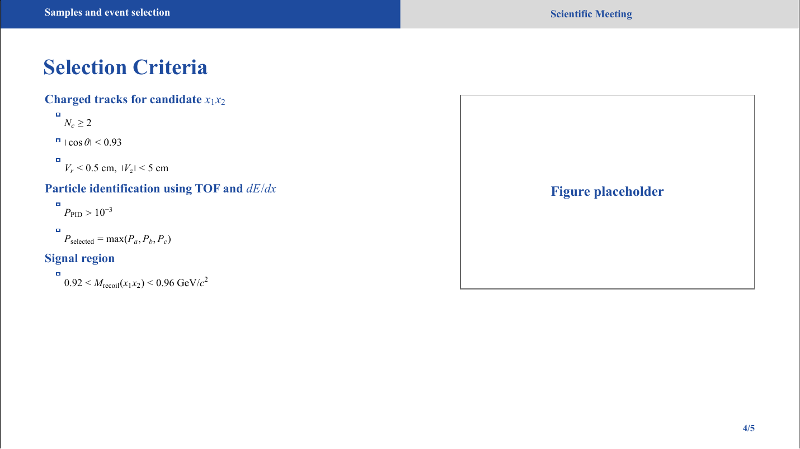

# Slidev Academy Theme

`slidev-theme-mbb-academy` is a restrained academic Slidev theme for scientific meeting slides.

The theme follows the Slidev theme conventions: the package name starts with `slidev-theme-`, the package declares `slidev-theme` and `slidev` keywords, and the theme contributes appearance through global styles, default configuration, and reusable layouts.

## Preview

### Cover



### Outline



### Content



## Format Summary

- Font: Times New Roman for body text, titles, and math-adjacent text.
- Main color: academic blue `#1E4B9E`.
- Header: a full-width top bar split into blue left half and gray right half.
- Left header label: current outline section, inherited from slide frontmatter fields `section`, `sectionTitle`, or `sectionHeader`.
- Header label: centered in the right half, controlled by `--mbb-header-title`.
- Slide title: bold blue, compact and suitable for scientific meeting rooms.
- Page number: bottom right, theme-blue, generated by the layout components.
- References: compact bottom-left footer using `.refs`.
- Citation marks: inline blue superscript markers via `.cite`.
- Outline: blue title-style list with diamond graphic markers, not numeric ordering.
- Selection pages: `.selection-grid`, `.selection-groups`, `.selection-heading`, `.condition-list`, and `.condition-notes` for grouped cuts.
- Figures: `.fig-grid` plus `.cols-1`, `.cols-2`, `.cols-3`, `.cols-4`, with compact variants for dense pages.
- Math: KaTeX is imported and styled to inherit the surrounding font size and color.
- HTML-contained math: use the bundled `<InlineMath tex="..." />` component when formulas appear inside raw HTML blocks.

## Usage

For local development inside this repository:

```md
---
theme: ./
title: My Academic Talk
transition: none
mdc: true
---
```

For an installed package:

```md
---
theme: slidev-theme-mbb-academy
title: My Academic Talk
transition: none
mdc: true
---
```

Change the meeting label by overriding the CSS variable:

```html
<style>
:root {
  --mbb-header-title: "International Physics Workshop";
}
</style>
```

Set the current outline section in slide frontmatter. The value is inherited by later slides until a new section is declared:

```md
---
layout: section
section: Samples and event selection
---

---
layout: default
---

# Selection Criteria
```

Use `hideSectionHeader: true` on pages where the left header should be blank, such as the cover page.

## Layouts

- `cover`: title page; use `.cover-logos`, `.cover-title`, `.authors`, `.institutions`, and `.cover-date`.
- `default`: standard content page.
- `section`: section divider page; use `.section-block` and `.section-subtitle`.
- `two-cols`: two-column content page; use `.columns`.

## Common Helpers

```html
<ul class="outline-list">
  <li>Motivation</li>
  <li>Data and MC samples</li>
</ul>
```

```html
<div class="selection-grid">
  <div class="selection-groups">
    <div class="selection-group">
      <div class="selection-heading">Charged tracks</div>
      <ul class="condition-list">
        <li><InlineMath tex="|\cos\theta|<0.93" /></li>
      </ul>
    </div>
  </div>
</div>
```

```html
<div class="fig-grid cols-3">
  
  
  
</div>
```

For a layout-only placeholder before figures are ready:

```html
<div class="fig-grid cols-2">
  <div class="figure-placeholder">Plot A</div>
  <div class="figure-placeholder">Plot B</div>
</div>
```

## Development

```bash
pnpm install
pnpm run dev
pnpm run export
```

The demo deck is `slides.md`. Slidev 52 requires Node.js 20 or newer.

The export script uses the local Google Chrome application on macOS. To avoid downloading a bundled browser during setup, install with:

```bash
PLAYWRIGHT_SKIP_BROWSER_DOWNLOAD=1 pnpm install
```
